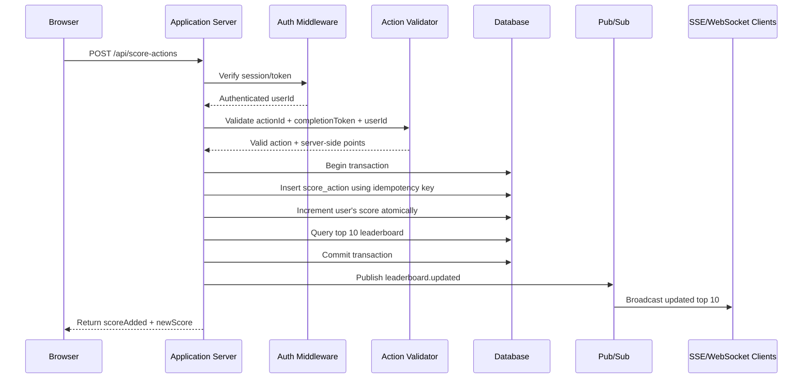

# Problem 6: Scoreboard Module Specification

## Overview

This module manages user score updates and publishes a live top-10 scoreboard to website clients.

The module must not trust score values sent by the browser. A client may only submit proof that an eligible action was completed. The backend validates the request, computes the score increment server-side, persists it atomically, and broadcasts the updated leaderboard.

## Goals

- Maintain a top-10 scoreboard.
- Update the scoreboard live when scores change.
- Accept score updates after a user completes an action.
- Prevent unauthorized or forged score increases.
- Provide a clear API and execution flow for implementation.

## Non-goals

- Defining what the user action is.
- Building the frontend UI.
- Designing a full fraud detection platform.
- Supporting arbitrary user-submitted score amounts.

## Core Concepts

### Score

A user has one aggregate score.

```ts
interface UserScore {
  userId: string;
  score: number;
  updatedAt: string;
}
```

### Action Completion

The client reports that an action was completed. The backend validates the completion and decides how many points to add.

```ts
interface ScoreAction {
  actionId: string;
  userId: string;
  points: number;
  idempotencyKey: string;
  createdAt: string;
}
```

`idempotencyKey` prevents accidental double submission and replay of the same action completion.

## API Design

### Authentication

All write APIs require an authenticated user session or bearer token.

The authenticated user ID must come from the server-side auth context, not from the request body.

### Get Current Leaderboard

```http
GET /api/scoreboard/top
```

Returns the current top 10 users.

Response:

```json
{
  "data": [
    {
      "rank": 1,
      "userId": "user_123",
      "displayName": "Alice",
      "score": 1250,
      "updatedAt": "2026-05-13T10:15:30.000Z"
    }
  ]
}
```

### Submit Completed Action

```http
POST /api/score-actions
Authorization: Bearer <token>
Idempotency-Key: <unique-client-generated-key>
Content-Type: application/json
```

Request:

```json
{
  "actionId": "daily_check_in",
  "completionToken": "server-issued-or-signed-token"
}
```

Response:

```json
{
  "data": {
    "userId": "user_123",
    "scoreAdded": 10,
    "newScore": 1260,
    "leaderboardChanged": true
  }
}
```

Validation rules:

- Request must be authenticated.
- `Idempotency-Key` is required.
- `actionId` must be a known action.
- `completionToken` must be valid for the authenticated user and action.
- The same completion must not be processed more than once.
- The client must not be allowed to submit `score`, `points`, or `userId`.

### Live Scoreboard Stream

Preferred transport:

```http
GET /api/scoreboard/stream
Accept: text/event-stream
```

Use Server-Sent Events for one-way live updates from server to browser. WebSocket is also acceptable if the product already uses it.

Event:

```json
{
  "type": "leaderboard.updated",
  "data": [
    {
      "rank": 1,
      "userId": "user_123",
      "displayName": "Alice",
      "score": 1260,
      "updatedAt": "2026-05-13T10:16:04.000Z"
    }
  ]
}
```

Client behavior:

- Load initial data from `GET /api/scoreboard/top`.
- Subscribe to `/api/scoreboard/stream`.
- Replace the visible top-10 list when a `leaderboard.updated` event is received.
- Reconnect with backoff if the stream disconnects.

## Execution Flow



## Data Model

### `user_scores`

Stores the aggregate score for each user.

| Column | Type | Notes |
| --- | --- | --- |
| `user_id` | string | Primary key |
| `score` | integer | Non-negative |
| `updated_at` | timestamp | Last score change |

Indexes:

- `score DESC, updated_at ASC` for top-10 queries.

### `score_actions`

Stores processed action completions for auditability and idempotency.

| Column | Type | Notes |
| --- | --- | --- |
| `id` | string | Primary key |
| `user_id` | string | Authenticated user |
| `action_id` | string | Known action identifier |
| `points` | integer | Server-computed increment |
| `idempotency_key` | string | Unique per user/action submission |
| `created_at` | timestamp | Processing time |

Constraints:

- Unique index on `user_id, idempotency_key`.
- Optional unique index on `user_id, action_id, completion_token_id` if each completion token can only be used once.

## Authorization and Abuse Prevention

The main security rule is: score increments must be decided by the server.

Recommended protections:

- Authenticate every score update request.
- Derive `userId` from the auth token/session.
- Validate that the submitted action was genuinely completed.
- Use signed, short-lived completion tokens when the action completes.
- Store processed completions to prevent replay.
- Require idempotency keys.
- Rate-limit score update requests per user and IP.
- Log suspicious failures, repeated invalid tokens, and high-frequency submissions.
- Keep an audit trail of all score changes.

Example completion token payload:

```json
{
  "userId": "user_123",
  "actionId": "daily_check_in",
  "completionId": "completion_789",
  "points": 10,
  "expiresAt": "2026-05-13T10:20:00.000Z"
}
```

The token must be signed by the backend or by a trusted internal service. The client can carry the token but must not be able to modify it.

## Consistency Requirements

- Score update must be atomic.
- Idempotency record and score increment must be written in the same transaction.
- The leaderboard should be queried after the score update commits or inside the same transaction.
- If broadcasting fails, the API request may still succeed, but the failure must be logged and clients should recover on reconnect or refresh.

## Realtime Update Strategy

For a single server:

- Keep SSE connections in memory.
- Broadcast the updated top 10 after each successful score update.

For multiple servers:

- Publish `leaderboard.updated` through Redis Pub/Sub, Kafka, NATS, or another message broker.
- Each API instance forwards the event to its connected clients.

Recommended event payload:

```ts
interface LeaderboardUpdatedEvent {
  type: "leaderboard.updated";
  data: LeaderboardEntry[];
  version: number;
  emittedAt: string;
}
```

Use `version` to ignore stale events on clients.

## Error Handling

| Case | HTTP Status | Response |
| --- | --- | --- |
| Missing/invalid auth | `401` | `{ "error": { "message": "Unauthorized" } }` |
| Authenticated but forbidden action | `403` | `{ "error": { "message": "Forbidden" } }` |
| Invalid request body | `400` | `{ "error": { "message": "Invalid request" } }` |
| Unknown action | `404` | `{ "error": { "message": "Action not found" } }` |
| Duplicate idempotency key | `200` or `409` | Return original result if possible |
| Rate limit exceeded | `429` | `{ "error": { "message": "Too many requests" } }` |
| Server error | `500` | `{ "error": { "message": "Internal server error" } }` |

For duplicate idempotency keys, returning the original successful response is preferred because it is safer for client retries.

## Implementation Notes

Suggested module boundaries:

- `ScoreActionController`: HTTP handlers.
- `ScoreActionService`: validation orchestration and score update transaction.
- `LeaderboardService`: top-10 query and ranking logic.
- `LeaderboardPublisher`: emits updates to pub/sub or local stream manager.
- `CompletionTokenVerifier`: verifies signed completion tokens.
- `ScoreRepository`: database reads/writes.

Suggested endpoint ownership:

- Score update endpoint belongs to the API application server.
- Action completion verification can be internal to this module or delegated to the service that owns the action.

## Testing Requirements

Unit tests:

- Valid action increments score.
- Request cannot choose its own user ID.
- Request cannot choose its own score increment.
- Duplicate idempotency key does not double-increment.
- Invalid completion token is rejected.
- Expired completion token is rejected.
- Unknown action is rejected.
- Top-10 query returns correct ranking.

Integration tests:

- `POST /api/score-actions` updates database and returns new score.
- `GET /api/scoreboard/top` returns updated ranking.
- SSE/WebSocket clients receive `leaderboard.updated`.
- Concurrent submissions for the same user do not lose updates.
- Rate limit returns `429`.

## Additional Improvement Comments

- Consider caching the top-10 leaderboard in Redis if read traffic is high.
- Consider a background worker for broadcasting if update volume becomes large.
- Consider periodic leaderboard snapshots for analytics and audit.
- Consider separate leaderboards by season, region, or game mode if product requirements grow.
- Consider anomaly detection for impossible score growth patterns.
- Consider admin tooling to inspect and reverse fraudulent score actions.
- Consider exposing the current user's rank separately because top-10 alone may not show most users their own position.
